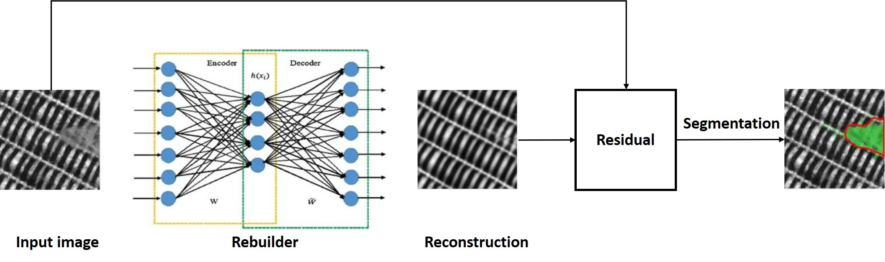

# DeeCamp-10Group-Unsupervised-Defect-Segmentation

# Abstract
Deep learning is well established in the mainstream of computer vision, but it relies on large amounts of data.
especially in the industrial field, such as product surface defect detection task. Mainstream neural networks framework 
(detection, semantic segmentation) must have defect samples (all defect types to be detected) for training, and the number 
of defect samples should not be too small. Although defect learning is relatively easy, heavy defect collection and labeling 
work is introduced. Moreover, in some production processes in the industrial field, it is difficult to provide sufficient 
defect samples for training with a low defect rate, and it is difficult to meet the 'data-hungry deep'learning model.In contrast, 
there are plenty of positive samples in industrial production that have no defects at all. We use this characteristic 
of industrial production to gain the ability to detect bad samples by learning only good samples. This defect detection technology 
based on positive samples can be applied to AI at low cost in more and more complex industrial scenarios, so it has great practical significance.

# Introduction
In this work, we focus on unsupervised defect segmentation for visual inspection. 
The goal is to segment defective regions in images after having trained exclusively on
non-defective samples. It has been shown that architectures based on convolutional neural networks (CNNs) such
as autoencoders or generative adversarial networks can be used for this task.
The input picture x into the autoencoder or GAN, get the restored image y. 
Then compare the features of each pixel of x and y, where the feature difference between x and y is large, that is
the defect.

# Architecture

# Directory 
- `/config`: This repo includes configuration file for training and evaluation. The parameters are saved in `.jason` file.
- `/db`: This repo includes codes of data set tools
- `/model`: Our networks codes are in `model/netwroks` and segmentation codes are in `mode/segmentation`.
- `/tools`: This repo includes codes of auxiliary function just like timer, log writer and so on. 
